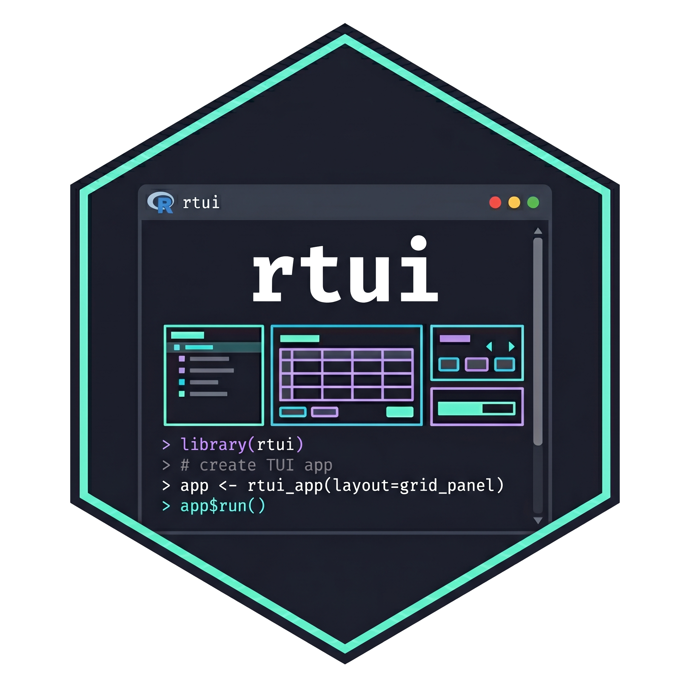

# rtui 

> Full-screen terminal user interfaces from R — powered by Python's [Textual](https://textual.textualize.io/) framework.

**rtui** gives R users 35+ widgets, 12 chart types, CSS-like styling, reactive state, screens, timers, key bindings, a command palette, and 10 built-in themes — all without writing a single line of Python. Under the hood it uses [reticulate](https://rstudio.github.io/reticulate/) to bridge R and Textual in a single process.

------------------------------------------------------------------------

## Features

| Category | Highlights |
|----|----|
| **Widgets** | Button, Input, TextArea, Select, Checkbox, Switch, RadioSet, DataTable, OptionList, SelectionList, Tabs, Tree, DirectoryTree, ProgressBar, Sparkline, Digits, Markdown, RichLog, Loading, Rule, and more |
| **Layouts** | `vstack()`, `hstack()`, `grid()`, `center()`, `middle()`, `scroll()`, `collapsible()`, `tabs()` |
| **Charts** | 12 chart types via plotext — bar, line, scatter, histogram, box, heatmap, candlestick, stacked/grouped bar, and more. Plus `plot_ggplot()` to render ggplot2 objects in the terminal |
| **State** | Mutable `tui_state()` with reactive bindings that auto-update widgets |
| **Screens** | `push_screen()` / `pop_screen()` for multi-page apps and modal dialogs |
| **Dialogs** | Built-in `confirm()` and `alert()` modal dialogs |
| **Timers** | `set_timer()`, `set_interval()`, `clear_timer()` for animations and polling |
| **Key bindings** | Declarative `binding()` objects shown in the footer |
| **Command palette** | `Ctrl+P` command palette with custom commands via `register_commands()` |
| **Themes** | 10 built-in colour themes (Dracula, Nord, Monokai, Gruvbox, Catppuccin, and more) |
| **Convenience** | `quick_app()` for one-call apps, `data_viewer()` for instant data exploration, `file_browser()` for directory browsing |

------------------------------------------------------------------------

## Installation

``` r
# Install the R package (from source)
devtools::install_local("path/to/rtui")

# Install Python dependencies (one-time setup)
rtui::install_python_deps()
```

**Requirements:** R \>= 4.1, Python \>= 3.9 (not Microsoft Store Python on Windows).

> **Important: rtui apps must be run from a real terminal** (Windows Terminal, iTerm2, Terminal.app, or any xterm-compatible terminal). They will **not** work in the RStudio console, R GUI, Jupyter notebooks, or any embedded console. Save your code as a `.R` file and run it with `Rscript`.

### Windows setup

``` r
# Point reticulate to the rtui virtualenv
Sys.setenv(RETICULATE_PYTHON_ENV = "r-rtui")
library(reticulate)
use_virtualenv("r-rtui", required = TRUE)
```

------------------------------------------------------------------------

## Quick start

> **Reminder:** All examples below must be saved as `.R` files and run from a real terminal with `Rscript my_app.R`. They will not work from RStudio or R GUI.

### Hello world

``` r
library(rtui)

quick_app(
  title = "Hello",
  layout = center(
    middle(
      text("Hello from rtui!")
    )
  )
)
```

### One-liner data explorer

``` r
data_viewer(mtcars)
```

Opens an interactive, scrollable, sortable data table. Press `q` to quit.

### Counter app

``` r
library(rtui)

quick_app(
  title = "Counter",
  layout = vstack(
    header(),
    center(middle(vstack(
      digits("0", id = "count"),
      hstack(
        button("-1", id = "dec"),
        button("+1", id = "inc"),
        button("Reset", id = "reset")
      )
    ))),
    footer()
  ),

  on_click = list(
    inc = function(event, state) {
      n <- state$get("n", 0L) + 1L
      state$set("n", n)
      update(state$app, "count", value = as.character(n))
      state
    },
    dec = function(event, state) {
      n <- state$get("n", 0L) - 1L
      state$set("n", n)
      update(state$app, "count", value = as.character(n))
      state
    },
    reset = function(event, state) {
      state$set("n", 0L)
      update(state$app, "count", value = "0")
      state
    }
  ),

  bindings = list(
    binding("q", "quit_app", "Quit", priority = TRUE)
  ),
  on_action = function(event, state) {
    if (event$value == "quit_app") return(quit())
    state
  }
)
```

------------------------------------------------------------------------

## Examples

rtui ships with 12 runnable examples in `inst/examples/`:

| Example | Features |
|---------|----------|
| **01-hello** | Minimal app — text, box, key handler |
| **02-list-detail** | Master-detail with list_view and update() |
| **03-data-table** | Interactive data.frame table |
| **04-dfdiff-explorer** | List-detail with mount state |
| **05-counter** | Reactive bindings, digits, buttons |
| **06-form** | tui_form(), confirm dialog, validation |
| **07-timer** | Stopwatch with set_interval, progress bar, laps |
| **08-tabs-dashboard** | Tabs, KPI cards, sparklines, charts, themes |
| **09-todo** | CRUD todo list with confirm delete |
| **10-charts** | Chart gallery — bar, line, scatter, histogram, heatmap |
| **11-screens-modal** | push_screen, pop_screen, settings modal |
| **12-reactive-dashboard** | Reactive formulas, auto-updating sparklines, timers |

``` powershell
Rscript inst/examples/05-counter.R
```

------------------------------------------------------------------------

## Showcase apps

rtui ships with 8 demo apps in `spikes/` that demonstrate real-world usage:

| App | Description |
|----|----|
| **Stock Tracker** | Live (simulated) stock prices, candlestick charts, sparklines |
| **System Monitor** | Real-time CPU, memory, disk usage with sparklines and process table |
| **Log Viewer** | Coloured log output with severity filter, search, and pause/resume |
| **CSV Explorer** | Browse R datasets with sortable tables and 5 chart types |
| **ggplot Explorer** | 8 ggplot2 examples rendered as terminal charts, command palette |
| **Pomodoro Timer** | Big-digit countdown, work/break cycles, session history |
| **Git Dashboard** | Commit log, file type stats, contributor charts for any git repo |
| **Markdown Notes** | Create, edit, search, and delete notes with live markdown preview |

Run any showcase from a real terminal:

``` powershell
# Windows
& "C:\Program Files\R\R-4.4.3\bin\Rscript.exe" spikes/showcase_pomodoro.R

# macOS/Linux
Rscript spikes/showcase_pomodoro.R
```

------------------------------------------------------------------------

## Concepts

### Layout

Layouts are built with container functions that accept child widgets:

| Function           | Description                    |
|--------------------|--------------------------------|
| `vstack(...)`      | Stack children vertically      |
| `hstack(...)`      | Stack children horizontally    |
| `grid(...)`        | CSS grid layout                |
| `center(...)`      | Center horizontally            |
| `middle(...)`      | Center vertically              |
| `scroll(...)`      | Scrollable container           |
| `box(child)`       | Container with optional border |
| `collapsible(...)` | Collapsible section with title |
| `tabs(...)`        | Tabbed content container       |

### Widgets

**Display:** `text()`, `static()`, `markdown()`, `digits()`, `pretty_table()`, `sparkline()`, `progress_bar()`, `rule()`, `loading()`, `placeholder()`, `log_view()`

**Input:** `input()`, `button()`, `checkbox()`, `switch_input()`, `select()`, `radio_set()`, `radio_button()`, `text_area()`, `masked_input()`, `option_list()`, `selection_list()`, `list_view()`, `data_table()`

**Navigation:** `header()`, `footer()`, `tabs()`, `tab_pane()`, `collapsible()`, `content_switcher()`, `tree()`, `directory_tree()`

### Events & handlers

Handlers are `function(event, state)` that return `state`:

``` r
tui_app(
  ...,
  on_mount   = function(event, state) { ... },  # App started
  on_click   = function(event, state) { ... },  # Button/item click
  on_change  = function(event, state) { ... },  # Value changed
  on_key     = function(event, state) { ... },  # Key pressed
  on_submit  = function(event, state) { ... },  # Enter in Input
  on_timer   = function(event, state) { ... },  # Timer fired
  on_action  = function(event, state) { ... },  # Key binding action
  on_screen_result = function(event, state) { ... }  # Screen dismissed
)
```

**Per-widget-id routing** — pass a named list instead of a function:

``` r
on_click = list(
  save_btn   = function(event, state) { ... },
  cancel_btn = function(event, state) { ... },
  .default   = function(event, state) { ... }   # catch-all
)
```

### State

State is a mutable key-value store passed to every handler:

``` r
state$set("count", 10)
state$get("count")        # 10
state$get("missing", 0)   # 0 (default)
state$app                  # the running app (for update/notify)
```

### Reactive bindings

Skip manual `update()` calls — bind state keys to widgets:

``` r
quick_app(
  layout = vstack(
    digits("0", id = "display"),
    button("+1", id = "inc"),
    id = "root"
  ),
  reactive = reactive(count = "display"),
  on_click = list(
    inc = function(event, state) {
      state$set("count", state$get("count", 0L) + 1L)
      state
    }
  )
)
```

### Updating widgets

``` r
update(app, "widget_id", content = "new text")  # text, static, markdown
update(app, "widget_id", value = "new value")   # input, digits, switch
update(app, "widget_id", label = "new label")   # button, checkbox
update(app, "widget_id", disabled = TRUE)        # any widget
update(app, "widget_id", display = FALSE)        # show/hide
```

### Charts

12 chart types with `plot_*()` functions:

``` r
# Bar chart
plot_bar(app, "chart_id",
         labels = c("A", "B", "C"),
         values = c(10, 25, 15),
         title = "Sales", color = "cyan")

# Render a ggplot2 object in the terminal
library(ggplot2)
p <- ggplot(mtcars, aes(wt, mpg)) + geom_point() + geom_smooth()
plot_ggplot(app, "chart_id", p)
```

Available: `plot_bar()`, `plot_line()`, `plot_scatter()`, `plot_histogram()`, `plot_box()`, `plot_heatmap()`, `plot_candlestick()`, `plot_stacked_bar()`, `plot_multiple_bar()`, `plot_pie()`, `plot_area()`, `plot_table()`

### Themes

``` r
# Apply a built-in theme
css = tui_theme("dracula")

# List all themes
list_themes()
#> "dracula" "nord" "monokai" "solarized_dark" "solarized_light"
#> "gruvbox" "catppuccin" "ocean" "forest" "sunset"
```

### Screens and dialogs

``` r
# One-line confirmation dialog
confirm(state$app, "Delete this item?")

# Handle the result
on_screen_result = function(event, state) {
  if (isTRUE(event$value)) {
    # user confirmed
  }
  state
}
```

### Timers

``` r
set_timer(state$app, 2, "my_timer")     # One-shot (2 seconds)
set_interval(state$app, 1, "tick")      # Repeating (every 1 second)
clear_timer(state$app, "tick")           # Cancel
```

### Command palette

``` r
register_commands(state$app, list(
  command("Reset Data", "reset", "Clear all data"),
  command("Export CSV", "export", "Save to CSV file")
))
```

Press `Ctrl+P` to open the palette.

------------------------------------------------------------------------

## Architecture

```         
R (your app code)
  │
  ├── quick_app() / tui_app()       ← layout specs (nested R lists)
  ├── RtuiApp R6 class              ← state, event dispatch
  └── reticulate bridge
        ↓
Python (rtui_shim)
  ├── app.py    ← Textual App subclass, widget tree, event routing
  └── factory.py ← maps spec "kind" → Textual widget class
```

Event flow: **Textual event → Python handler → R callback → `update()` → Python applies patches**

------------------------------------------------------------------------

## Convenience functions

| Function             | Description                     |
|----------------------|---------------------------------|
| `quick_app(...)`     | Build + run in one call         |
| `data_viewer(df)`    | Interactive data.frame explorer |
| `browse_files(path)` | Terminal file browser           |

------------------------------------------------------------------------

## License

MIT
